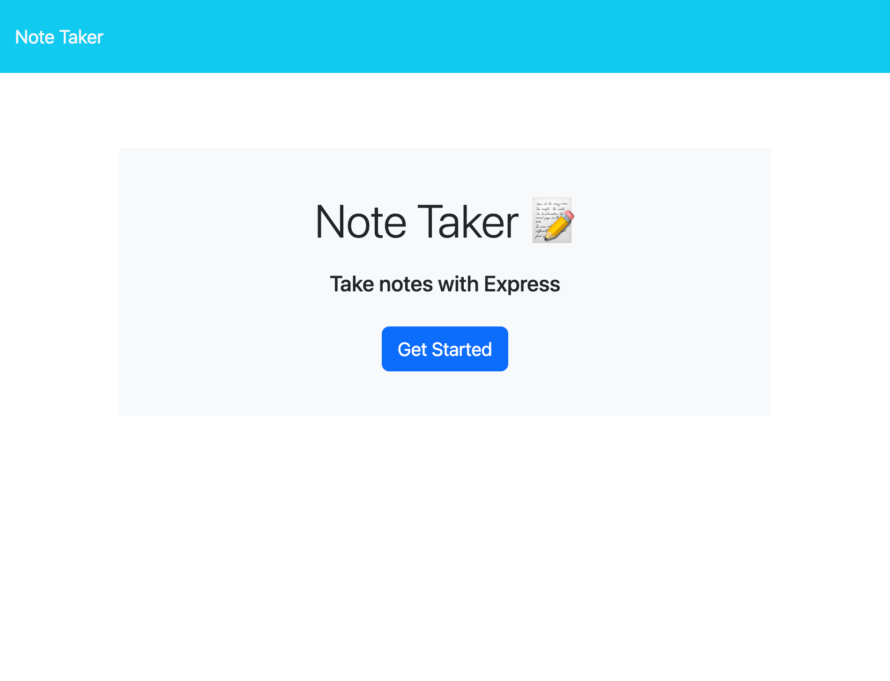
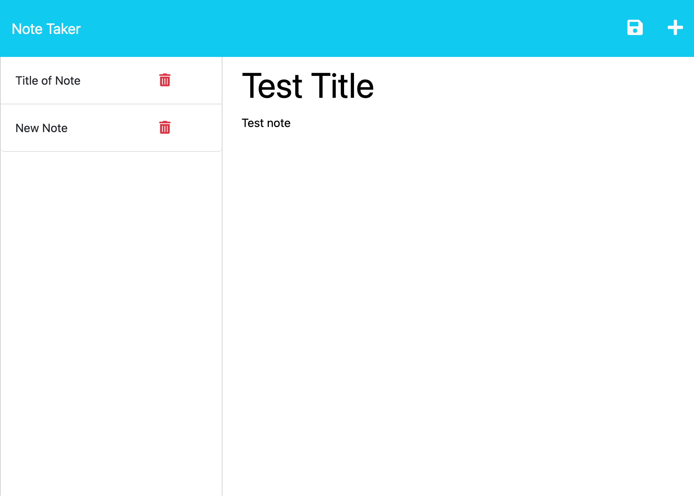

# note-taker
Module 11: Express.js

## User Story

```
AS A small business owner
I WANT to be able to write and save notes
SO THAT I can organize my thoughts and keep track of tasks I need to complete
```


## Acceptance Criteria

```
GIVEN a note-taking application
WHEN I open the Note Taker
THEN I am presented with a landing page with a link to a notes page
WHEN I click on the link to the notes page
THEN I am presented with a page with existing notes listed in the left-hand column, plus empty fields to enter a new note title and the note’s text in the right-hand column
WHEN I enter a new note title and the note’s text
THEN a Save icon appears in the navigation at the top of the page
WHEN I click on the Save icon
THEN the new note I have entered is saved and appears in the left-hand column with the other existing notes
WHEN I click on an existing note in the list in the left-hand column
THEN that note appears in the right-hand column
WHEN I click on the Write icon in the navigation at the top of the page
THEN I am presented with empty fields to enter a new note title and the note’s text in the right-hand column
```
## Installation
Requires Node.js and Express

## Usage
Deployed to Heroku
<!-- Add link to deployed page -->

When opening the application, user will be presented with a welcome screen, and a button to get started:



Clicking the start button will load the notes page, which has a column on the left that displays existing notes (page should load with 2 example notes), and a field for saving a new note on the right:


To save a note, enter a note title and note text. Once these fields have text content, a save button will appear in the nav bar:



When the save button is clicked, the new note title will display in the left column:


## Credits
Used starter code from Columbia Engineering Coding Bootcamp Week 11
Worked on with Tutor: Eric Sayer